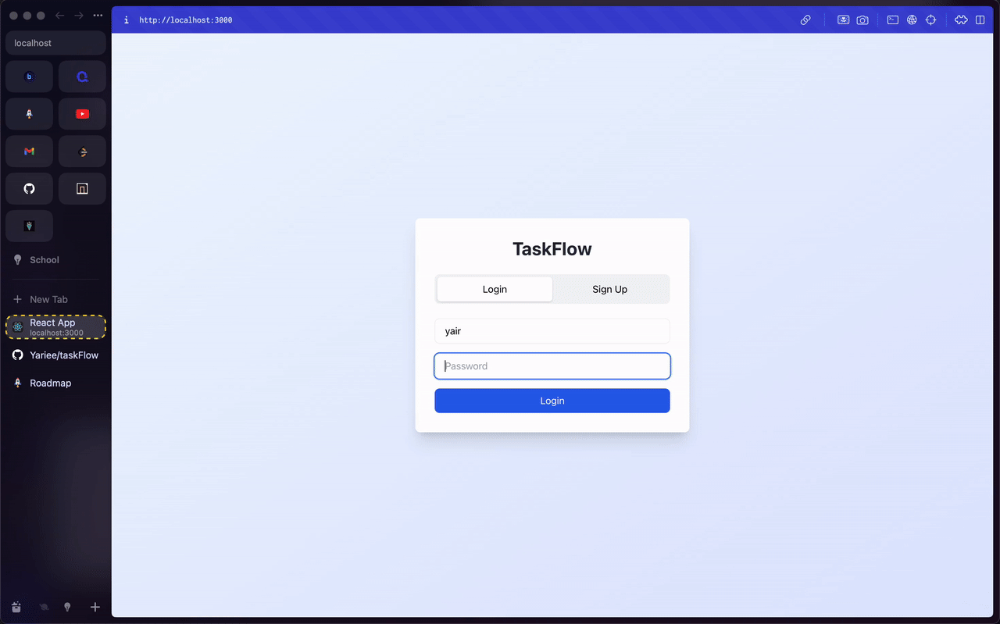
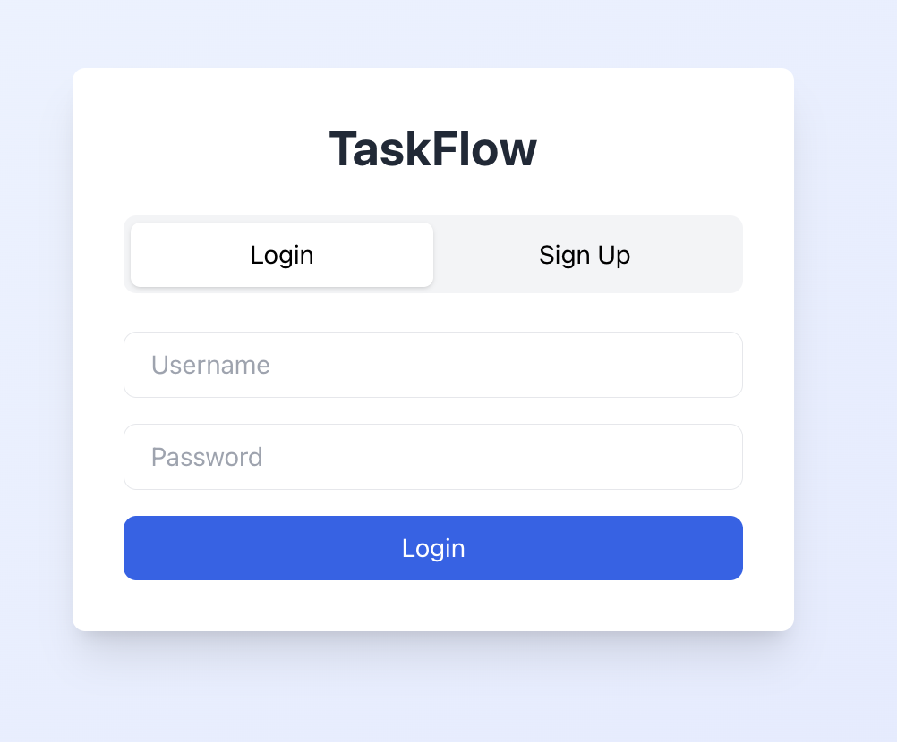
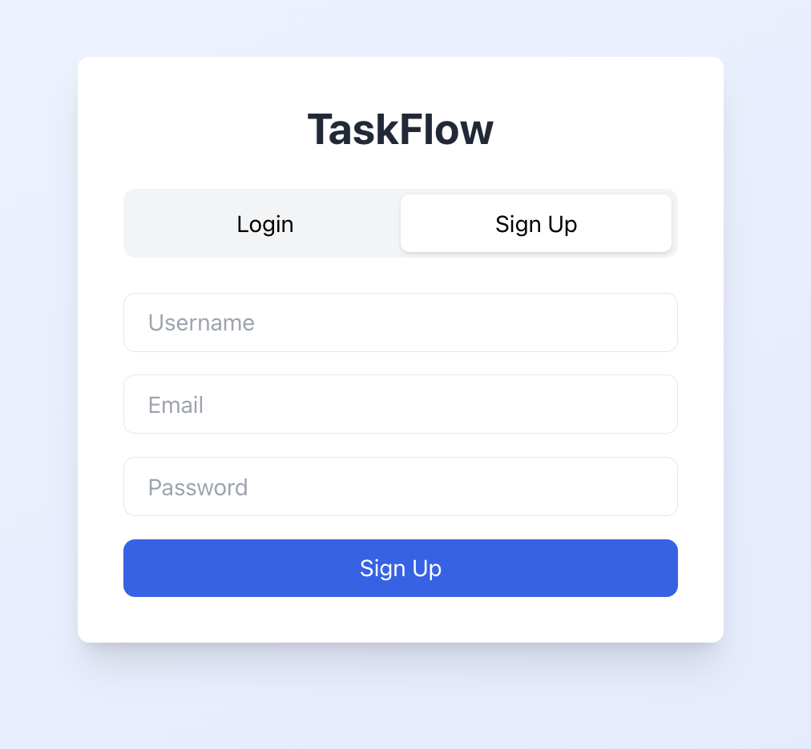
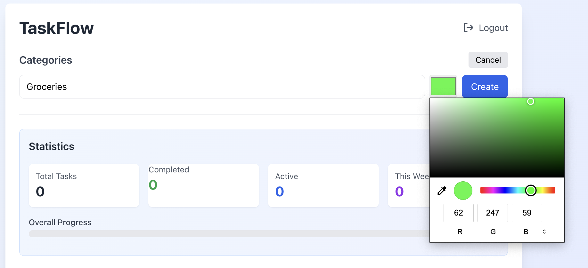
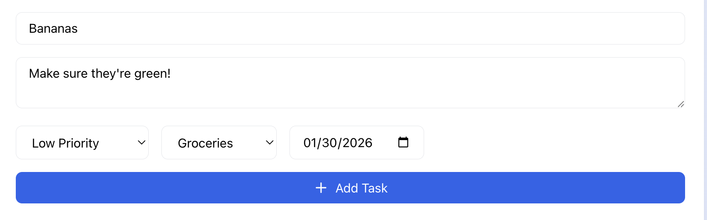

# Taskflow - A Task management Application

Taskflow is a full stack management application built with React and Flask. It features user authentication, category
organization, real-time task search and a analytics dashboard.

## Demo



## Features

- **User Authentication** - Secure signup/login with token based authentication
- **Task Management** - Create, update and delete tasks with a description
- **Categories** - Organize tasks with custom color coded categories 
- **Filtering** - Filter tasks by status (all/active/completed) and categories
- **Real-time Search** - Search tasks in real time by title or description
- **Analytics Dashboard** - Track completion rates, weekly progress and breakdowns based on priority
- **Responsive Design** - Works both on desktop and mobile devices


## Screenshots

<details>
<summary>Click to view screenshots</summary>

### Authentication



### Task Management



</details>

## Technologies Used

### Frontend
- React.js
- Tailwind CSS
- Lucide React 

### Backend
- Python Flask
- Flask-SQLAlchemy (ORM)
- Flask-CORS
- JWT Authentication 
- SQLite Database

## Setup Instructions

### Prerequisites
- Python 3.9+
- Node.js 14+
- npm or yarn

### Backend Setup
1. Clone the repository
```bash
git clone https://github.com/Yariee/taskflow.git
cd task/backend
```

2. Create and activate virtual environment
```bash
python -m venv venv
source venv/bin/activate 
```

3. Install dependencies
```bash
pip install -r requirements.txt
```

4. Run the flask server
```bash
python app.app
```

Backend will be running on 'http://localhost:5001'

### Frontend Setup

1. Navigate to frontend folder
```bash
cd ../frontend
```

2. Install dependencies
```bash
npm install
```

3. Start the React app
```bash
npm start
```

App will open at 'http://localhost:3000'


## Usage

1. **Sign up** - Create an account
2. **Create Categories** - Set up categories for your needed tasks (Work, Personal, etc.)
3. **Add Tasks** - Create tasks with titles, descriptions, priorities, due dates or categories
4. **Search and Filter** - Use the search bar to filter by categories/status
5. **Track Progress** - Monitor productivity with the statistics dashboard

## Future Enhancements

- Task Sharing between users with collaboration in mind
- Email notifications for due dates
- Recurring tasks
- Dark Mode
- Mobile App version

## Author
**Yair Ballinas**
- Github: [@Yariee](https://github.com/yariee)
- LinkedIn: [Yair Ballinas](https://www.linkedin.com/in/yair-ballinas/)

## License

This project is licensed under the MIT License.